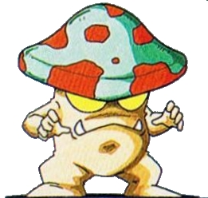
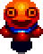
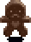

# Indie Studio

## Compilation
### Linux
* \$> mkdir build
* \$> cd build
* \$> cmake ..
* \$> make

### Windows
* \$> mkdir build
* \$> cd build
* \$> cmake -A x64 ..
* \$> cmake --build .
* L'exécutable se trouve dans le dossier /Debug, pour fonctionner correctement il doit être à la racine dans /build

## Personnage
### Power-ups
|**Power**|**Description**|
|---:|:---|
|SpeedUp|Augmente la vitesse de déplacement du joueur de 1|
|BombUp|Augmente le nombre de bombes qu'un joueur peut avoir sur le terrain en même temps|
|WallPass|Permet au joueur de marcher librement dans les blocs souples|
|FireUp|Augmente la portée du souffle de la bombe de 1|

## Ennemies
|**Ennemies**|**Images**|
|---:|:---|
|Matango||
|Seeker Balloon||
|Gingerbread Man||

## Gameplay
|**Personnage**|**Touches**|**Effet**|
|---:|:---|:---|
|Principal|Flèche du haut Flèche du bas Flèche de gauche Flèche de droite Touche 'M'|Vers le haut Vers le bas Vers la gauche Vers la droite Pose de bombe|
|Second|Touche 'Z' Touche 'S' Touche 'Q' Touche 'D' Touche 'A'|Vers le haut Vers le bas Vers la gauche Vers la droite Pose de bombe|
